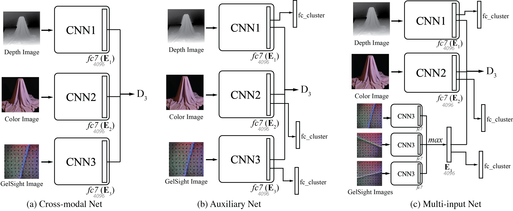

# Connecting Look and Feel


> **Connecting Look and Feel: Associating the visual and tactile properties of physical materials**
> 
> Wenzhen Yuan\*, Shaoxiong Wang\*, Siyuan Dong, Edward Adelson
>  (\* indicates equal contributions)
> 
> CVPR 2017 (oral)
> 

[[paper]](https://arxiv.org/pdf/1704.03822.pdf) [[data]](http://people.csail.mit.edu/%20yuan_wz/fabricdata/GelFabric.tar.gz) [[project page]](https://github.com/wx405557858/FabricGel)

Here we provide examples of infering look from feel.


The network structure



# Install

Here is the list of libraries you need to install to execute the code:

- keras == 1.2.2
- numpy
- scipy
- matplotlib
- scikit-learn
- pprint
- argparse

All of them can be installed via `pip` , e.g.

```
pip install keras==1.2.2
```

# Run

```
CUDA_VISIBLE_DEVICES=0 python end2end_train.py -l test -m 2 -c _shop -g 0

usage: end2end_train.py [-h] [-l logdir] [-c cat] [-g gpu] [-w weight_fn]
                        [-t test] [-m given_margin]

Training Alexnet model for fabric joint embedding

optional arguments:
  -h, --help            show this help message and exit
  -l logdir, --logdir logdir
                        path to store evaluation
  -c cat, --cat cat     category
  -g gpu, --gpu gpu     gpu
  -w weight_fn, --weight_fn weight_fn
                        weights
  -t test, --test test  test
  -m given_margin, --given_margin given_margin
                        margin for contrastive loss
```

# Citation
```
@article{yuan2017connecting,
  title={Connecting Look and Feel: Associating the visual and tactile properties of physical materials},
  author={Yuan, Wenzhen and Wang, Shaoxiong and Dong, Siyuan and Adelson, Edward},
  journal={arXiv preprint arXiv:1704.03822},
  year={2017}
}
```